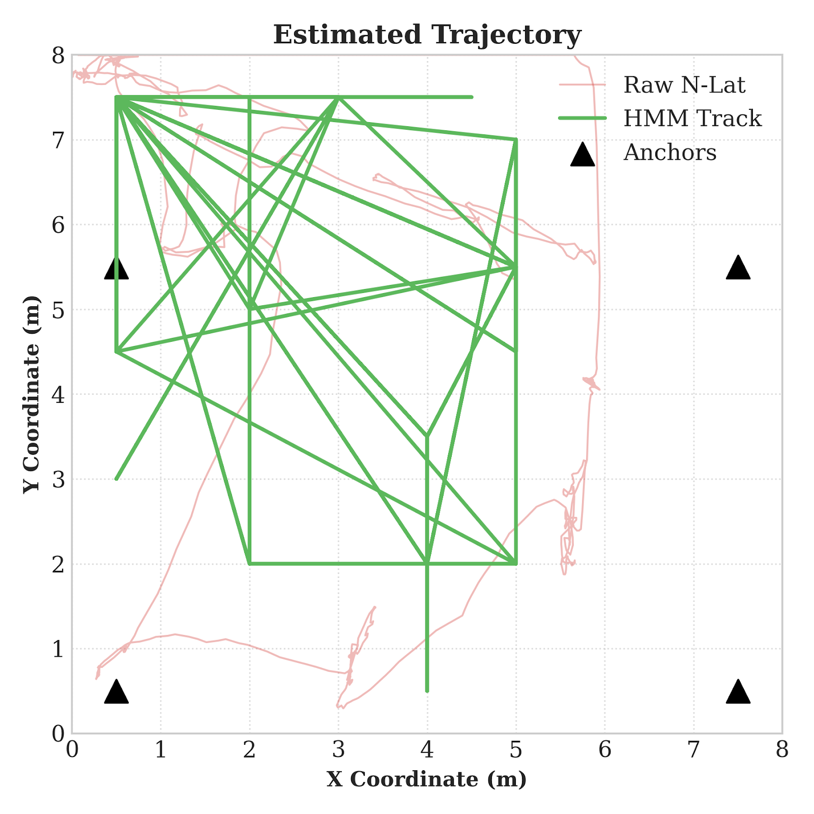
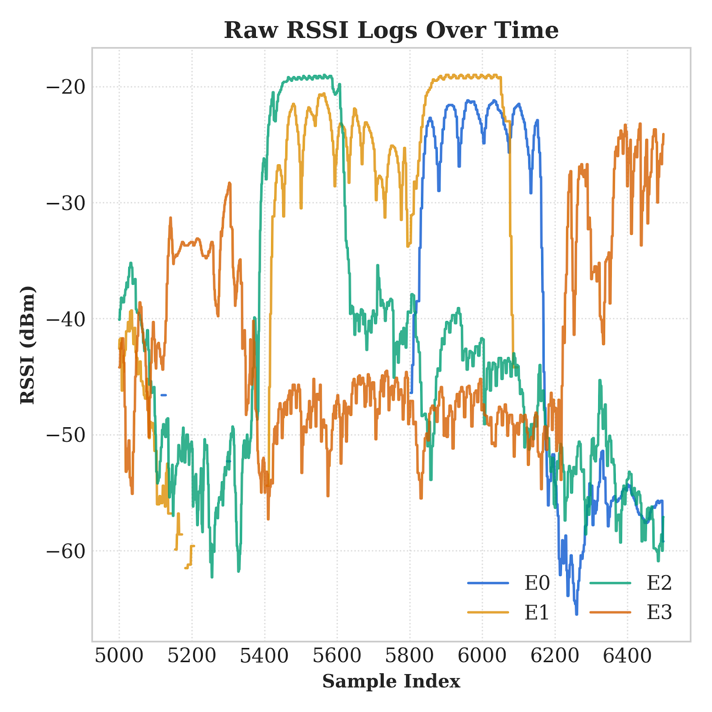

# IndoorLoRa

**Real-Time Indoor Positioning with LoRa RSSI — N-Lateration · Fingerprinting · HMM-Viterbi Tracking**

> Master 1 Internet of Things — UFR STGI, Université Marie et Louis Pasteur (Montbéliard, France)  
> EIPHI Graduate School · FEMTO-ST Institute

---

## System Architecture

The platform is organised in four tiers that carry a signal from antenna to pixel:


| Tier | Component | Role |
|------|-----------|------|
| **1 — Physical** | 4 × Adafruit Feather M0 LoRa (E0–E3) | Fixed anchors broadcasting 868 MHz LoRa beacons |
| **2 — Reception** | USRP B200mini + GNU Radio | SDR capture → LoRa demodulation → ZeroMQ PUB |
| **3 — Server** | `positioning_server.py` | ZMQ SUB → Kalman filter → 3 algorithms → SQLite → WebSocket |
| **4 — Dashboard** | `InDoorLora_Dashboard.html` | Real-time browser UI over WebSocket |

---

## Positioning Algorithms

Three algorithms run **concurrently** on every RSSI update:

| Algorithm | Approach | Mean Error (calibrated) |
|-----------|----------|------------------------|
| **N-Lateration** | RSSI → distance (log-distance path-loss), weighted nonlinear least squares (Levenberg–Marquardt) | ~1.4 m |
| **K-NN Fingerprinting** | Weighted K=3 nearest-neighbour in RSSI signal space over a calibrated radio map | ~1.0 m |
| **HMM-Viterbi** | Online Viterbi tracking with Gaussian motion-continuity transition model for smooth trajectories | **~0.86 m** |

Fingerprinting and HMM smoothing reduce N-Lateration's mean error by **~30 %** and **~45 %** respectively on a 221-point calibrated radio map.

### Trajectory comparison — raw N-Lat vs HMM track



### Per-anchor RSSI signal over time



---

## Hardware & Radio Parameters

| Parameter | Value |
|-----------|-------|
| **SDR receiver** | USRP B200mini |
| **Demodulator** | GNU Radio LoRa block |
| **Anchor hardware** | Adafruit Feather M0 + RFM95W (ARM Cortex-M0) |
| **Frequency** | 868.1 MHz (EU ISM band) |
| **Spreading Factor** | SF7 |
| **Bandwidth** | 125 kHz |
| **Coding Rate** | 4/5 |
| **TX Power** | 17 dBm (anchors) / 13 dBm (emitters) |
| **Beacon interval** | 500 ms TDMA cycle, 100 ms slots (E0 → E3) |
| **Anchors** | 4 (E0–E3) at room corners |
| **Room (M2 Classroom)** | 8 m × 6 m |
| **ZMQ transport** | `tcp://127.0.0.1:5556` |
| **WebSocket port** | `8765` |

---

## Live Dashboard

### Main view — Room blueprint with range circles & live position estimates


The dashboard shows:
- **Room canvas** with calibrated grid points, anchor positions (E0–E3), and dashed RSSI range circles
- **Live position dots** — 🔴 N-Lat, 🟢 FP, 🔵 HMM — updated every packet
- **RSSI bars** for all four anchors with dBm readout
- **Position estimates table** with algorithm status (active / no calib)
- **Event log** — timestamped raw packet stream

### OSM Map mode — campus overlay


When a GPS reference origin is set, the room blueprint is overlaid on a live **OpenStreetMap** tile layer (via Leaflet), enabling campus-scale multi-room navigation.

### Location management

| New Location dialog | Location switcher |
|--------------------|--------------------|
|  |  |

Every location stores its own room dimensions, anchor coordinates, calibration grid, and exported radio map — switch between rooms instantly from the dropdown.

---

## Repository Structure

```
InDoorLora/
│
├── positioning_server.py       # Core: ZMQ→Kalman→Algos→SQLite→WebSocket
├── InDoorLora_Dashboard.html   # Single-file real-time web dashboard
│
├── lora_rx_sim.py              # Dynamic RSSI simulator (no hardware needed)
├── usrp_lora_bridge.py         # USRP B200mini SDR → ZMQ bridge (GNU Radio)
├── serial_bridge.py            # Feather M0 USB serial → ZMQ bridge
├── find_emitter_map.py         # Auto-map emitter positions from RSSI scans
│
├── algorithms/
│   ├── nlat.py                 # N-Lateration (legacy reference)
│   ├── fp.py                   # K-NN Fingerprinting (legacy reference)
│   └── hmm.py                  # HMM-Viterbi (legacy reference)
│
├── emertters/                  # Arduino firmware (PlatformIO / Arduino IDE)
│   ├── E0/E0.ino               # Anchor E0 — bottom-left  (0.5, 0.5)
│   ├── E1/E1.ino               # Anchor E1 — bottom-right (7.5, 0.5)
│   ├── E2/E2.ino               # Anchor E2 — top-left     (0.5, 5.5)
│   ├── E3/E3.ino               # Anchor E3 — top-right    (7.5, 5.5)
│   └── reciver/reciver.ino     # Mobile receiver firmware
│
├── data/
│   ├── default/                # Default location calibration data
│   │   ├── radio_map.json
│   │   ├── training_dataset.csv
│   │   └── raw_log.csv
│   └── M1_ClassRoom_radio_map.json
│
├── fingerprint_maps/           # Exported per-location radio maps (JSON)
│
├── image/                      # System diagrams & result figures
├── DOC/                        # Dashboard screenshots & project reports
│
├── tests/
│   └── test_projection.py      # Unit tests
│
├── setup.ps1                   # Full Windows setup (Conda + GNU Radio + UHD)
├── START.bat                   # Quick-start launcher (server + USRP bridge)
└── README_Lora.md              # Extended technical notes
```

---

## Quick Start

### Requirements

- Python 3.10+
- `pip install pyzmq websockets numpy scipy`
- **For live hardware:** GNU Radio with a LoRa demodulation block + USRP B200mini drivers (UHD)
- **For firmware:** Arduino IDE with the [RadioHead](http://www.airspayce.com/mikem/arduino/RadioHead/) library

### Option A — Simulation mode (no hardware required)

```bash
# Clone
git clone https://github.com/AhmedAlmuharaq/IndoorLoRa.git
cd IndoorLoRa

# Install Python dependencies
pip install pyzmq websockets numpy scipy

# Terminal 1 — start the positioning server
python positioning_server.py --sim

# Then open the dashboard in any browser
# (double-click or drag into browser)
InDoorLora_Dashboard.html
```

The `--sim` flag automatically launches `lora_rx_sim.py`, which walks a rectangular path and emits realistic RSSI via ZMQ — no SDR required.

### Option B — Live hardware (USRP B200mini)

```bash
# Terminal 1 — GNU Radio flowgraph must already be running and publishing to tcp://127.0.0.1:5556
# If using the Python bridge instead:
python usrp_lora_bridge.py --debug

# Terminal 2 — positioning server (subscribes to ZMQ)
python positioning_server.py

# Then open InDoorLora_Dashboard.html in your browser
```

### Option C — Feather M0 serial receiver

Flash `emertters/reciver/reciver.ino` to a Feather M0, connect via USB, then:

```bash
python serial_bridge.py           # auto-detects COM port
# or
python serial_bridge.py --port COM4
```

### Windows one-click start

```bat
START.bat
```

Kills any process on port 5556, opens the positioning server and USRP bridge in separate console windows.

### Full environment setup (Windows, first time)

```powershell
# Run PowerShell as Administrator
Set-ExecutionPolicy RemoteSigned
.\setup.ps1
```

Installs Miniconda, creates the `indoorlora` conda environment, installs GNU Radio + UHD + gr-lora + all Python dependencies, downloads USRP FPGA images, and creates `run_indoorlora.bat`.

---

## Calibration Workflow

1. **Create a location** — click **+ New Location**, enter room name, dimensions (m), grid step, and anchor (x, y) coordinates.
2. **Place anchors** — deploy Feather M0 boards at the configured corners and start transmitting.
3. **Collect calibration points** — click a grid point on the canvas, press **▶ START**, wait 3 s (60 packets), press **■ STOP**. Repeat across the grid.
4. **Export radio map** — click **Export Map**; the JSON file is saved to `fingerprint_maps/`. Fingerprinting and HMM become active once ≥ 3 reference points are calibrated.
5. **Switch locations** — use the Location dropdown; all calibration data is per-location and persisted in SQLite.

---

## Packet Format

Every LoRa beacon carries a compact ASCII payload:

```
UE07,13,<emitter_id>,<sequence>
```

| Field | Value | Meaning |
|-------|-------|---------|
| `UE07` | fixed | Device type tag |
| `13` | fixed | Protocol version |
| `emitter_id` | 0–3 | Anchor index (E0–E3) |
| `sequence` | uint32 | Monotonic counter |

The ZMQ PDU wraps this payload with a JSON metadata header (`rssi`, `samp_rate`).

---

## Server internals

```
ZMQ SUB  ──→  parse_pdu()
                  │
                  ▼
           KalmanFilter1D (per anchor, q=0.05, r=3.0)
                  │
          ┌───────┼───────┐
          ▼       ▼       ▼
      NLateration  KNNFingerprint  HMMViterbi
          │       │               │
          └───────┴───────────────┘
                  │
           SQLite INSERT + commit
                  │
           WebSocket broadcast → dashboard
```

**WebSocket messages (server → clients)**

| Message type | When sent |
|---|---|
| `anchors_update` | On connect + anchor save |
| `location_changed` | On connect + location switch |
| `location_meta` | On connect |
| `all_locations` | On connect + location create |
| `position_update` | Every packet (RSSI + 3 estimates) |
| `calibration_progress` | During grid-point capture |

---

## Results

| Metric | N-Lateration | Fingerprinting | HMM-Viterbi |
|--------|-------------|----------------|-------------|
| Mean error (MAE) | ~1.4 m | ~1.0 m | **~0.86 m** |
| Improvement vs N-Lat | — | −29 % | **−45 %** |
| Calibration required | No | Yes (≥3 pts) | Yes (≥3 pts) |
| Radio map size (M2, 221 pts) | — | 221 points | 221 states |

---

## Authors

**Ahmed Al-Muharaq, Malick Diop, Oumnia Chiouikh, Cynthia Ayetolou**  
Master 1 Internet of Things, UFR STGI, Université Marie et Louis Pasteur, Montbéliard, France.

Supervised in collaboration with:
- **Philippe Canalda & François Spies** — FEMTO-ST Institute
- **Mariame Niang & Ibra Dioum** — University Cheikh Anta Diop of Dakar

Supported by the **EIPHI Graduate Schools**.

---

## License

MIT — see [LICENSE](LICENSE) for details.
